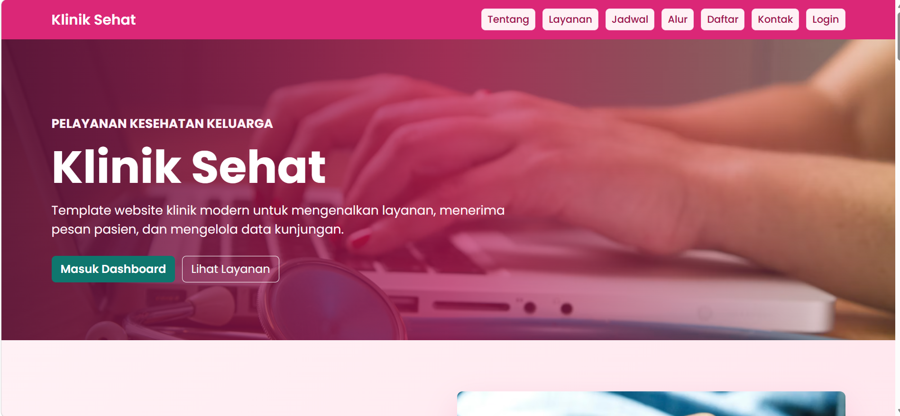
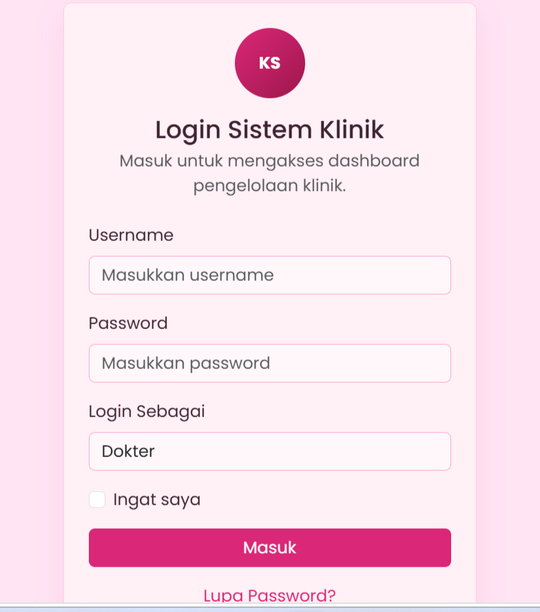
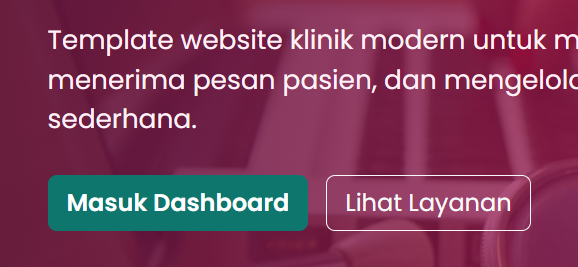
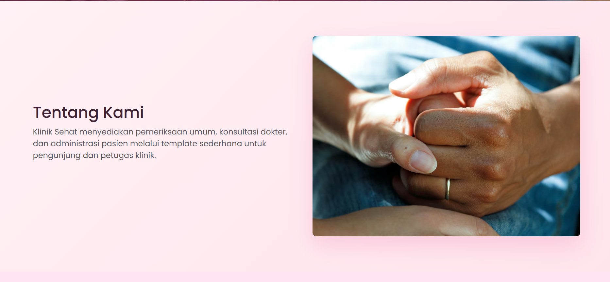
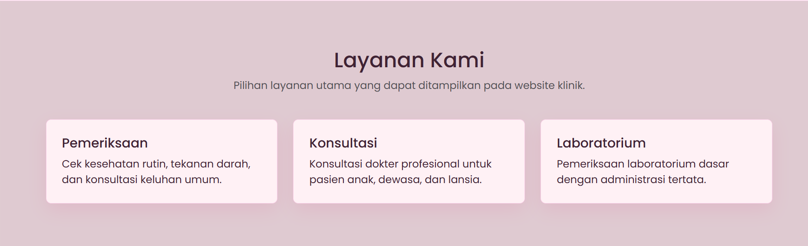
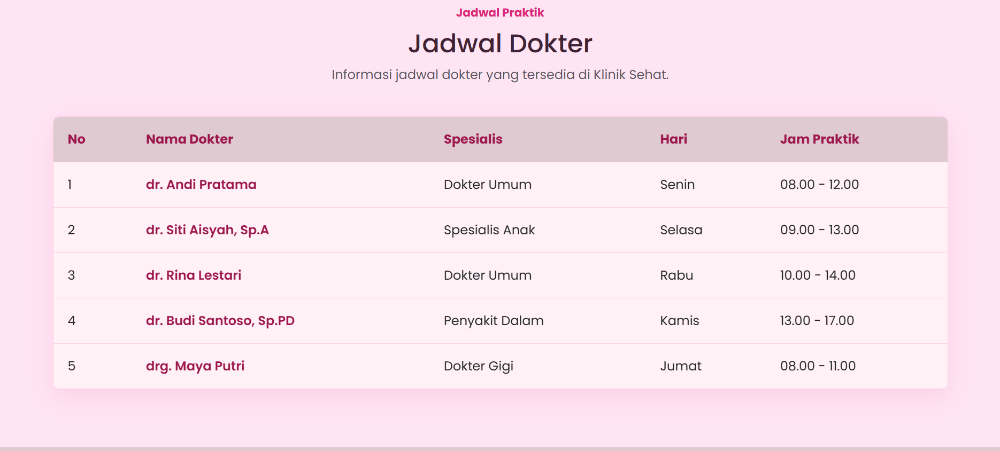
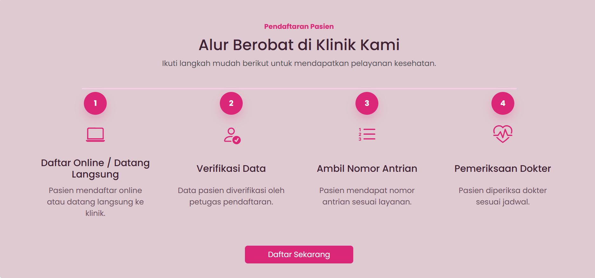
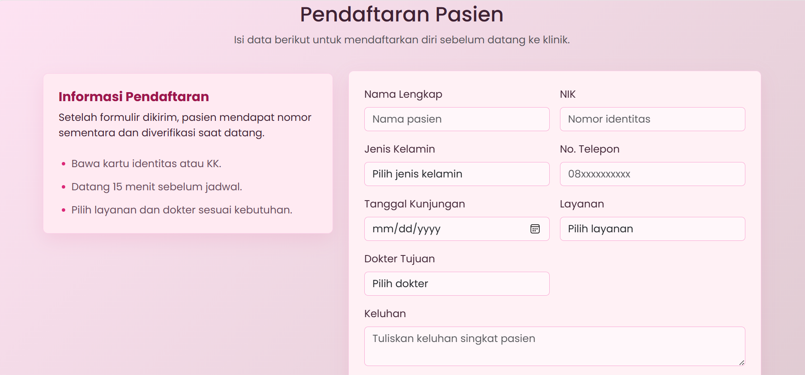
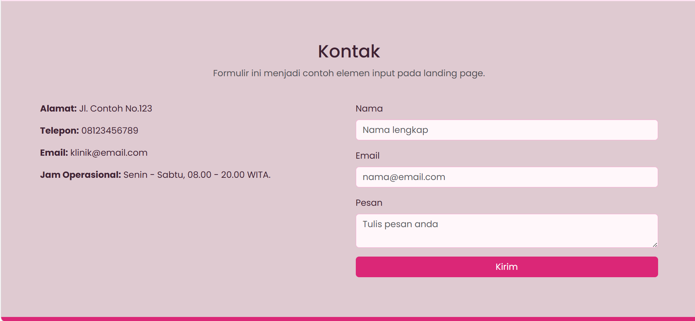

# Klinik Sehat

Klinik Sehat adalah template website klinik sederhana untuk tugas UTS. Template ini dibuat dengan HTML, CSS, dan Bootstrap CDN.

## Halaman

- `index.html`: landing page berisi profil klinik, layanan, jadwal dokter, alur berobat, formulir pendaftaran pasien, testimoni, gambar, link navigasi, dan formulir kontak.

- `login.html`: halaman login untuk masuk ke dashboard.

- `dashboard.html`: halaman dashboard berisi formulir tambah pasien dan tabel data kunjungan pasien.

## Elemen Template

Template sudah memuat elemen header, footer, heading, paragraf, gambar, link, formulir, dan tabel.

## Screenshot Tampilan

### Beranda

### Tombol Utama Beranda

### Tentang Kami

### Layanan Kami

### Jadwal Dokter

### Alur Berobat

### Form Pendaftaran Pasien

### Kontak Klinik

### Login Sistem Klinik

## Cara Membuka

Buka file `index.html` di browser, lalu gunakan tombol login untuk menuju halaman login dan dashboard.

## Struktur File

- `index.html` menampilkan halaman utama website klinik.
- `login.html` menampilkan halaman masuk ke sistem.
- `dashboard.html` menampilkan halaman pengelolaan data pasien.
- `css/style.css` menyimpan semua pengaturan warna, layout, tombol, kartu, tabel, form, dan tampilan responsif.
- `screenshot-tampilan-web/` menyimpan gambar dokumentasi tampilan website.

## Penjelasan Kode

Website ini memakai Bootstrap CDN untuk membantu membuat layout responsif, tombol, form, tabel, dan grid. File CSS tambahan dipakai untuk memberi identitas visual Klinik Sehat, seperti warna utama, kartu modern, hero beranda, badge status pasien, dan tampilan halaman login/dashboard.

## Alur Penggunaan

1. Pengunjung membuka `index.html`.
2. Pengunjung dapat melihat profil, layanan, jadwal dokter, alur berobat, dan formulir pendaftaran.
3. Formulir pendaftaran dan kontak ditampilkan sebagai contoh tampilan input.
4. Pengguna masuk melalui `login.html`.
5. Di `dashboard.html`, pengguna dapat melihat contoh tabel data pasien dan formulir tambah pasien.
